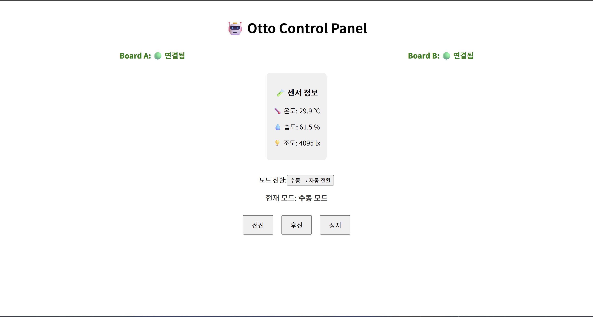

# 🤖 Otto Control Panel

MQTT 기반으로 **ESP32 Otto 로봇**을 원격 제어하고 센서 데이터를 실시간으로 시각화하는 **React 웹 대시보드**입니다.



---

## 🧠 주요 기능

- 🔌 **Board A / B 연결 상태 표시**
- 🌡️ 온도, 습도, 조도 센서 실시간 수신
- 🔁 수동 ↔ 자동 모드 전환
- 🧭 Otto 로봇 제어 버튼 (전진 / 후진 / 정지)
- 🛰️ MQTT 통신 기반 제어 (broker.emqx.io)

---

## ⚙️ 설치 및 실행

```bash
# 의존성 설치
npm install

# 개발 서버 실행
npm start
